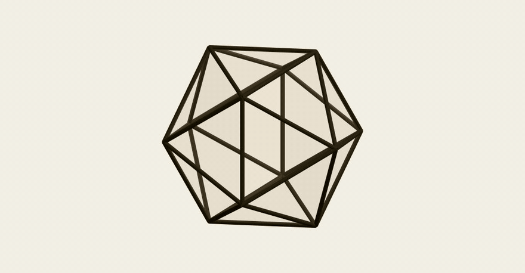

# Order in Space

**Live:** https://jameel7007.github.io/order-in-space/ · **Lab:** https://jameel7007.github.io/order-in-space/lab/ · [How it works](docs/HOW_IT_WORKS.md)



Order in Space is a geometry-first, scroll-driven study of polyhedral construction, after Keith Critchlow's *Order in Space* (1969). A point becomes a sphere, spheres gather, and their touching builds every regular solid; one moving point makes all eighteen named solids; a lattice grows; each sphere claims its cell; and everything returns to the point. Every frame is a pure function of scroll position, so the story runs backwards exactly, and the last frame equals the first.

Nothing is stored as a list of corners. The solids come from one point reflected in three mirrors, the packings from equal spheres touching, the space cell from cutting space fairly between neighbours, and the "why only five" argument from folding regular polygons around a corner. The `/lab` route is the deeper instrument: move the generator freely, tighten the shell of twelve spheres, or watch the Voronoi cell form, with every mirror distance, symbol, and count exposed.

## Quickstart

Requires Node 20.19 or newer (the deploy uses Node 24).

```sh
git clone https://github.com/Jameel7007/order-in-space.git
cd order-in-space
npm install
npm run dev
```

Then open `http://127.0.0.1:5173/` for the story and `http://127.0.0.1:5173/lab` for the lab. Other commands:

```sh
npm test            # 115 geometry, render, and story tests
npm run typecheck   # strict TypeScript
npm run build       # production build for GitHub Pages
npm run check       # boundaries + typecheck + tests + build (what CI runs)
```

## Use the geometry on its own

The mathematics lives in `packages/geometry` with no Three.js, DOM, or scroll dependency, and a script fails the build if that ever changes. It can be used without the visualizer:

```ts
import { wythoff, platonic, closestPacking, hullOfCenters, angularDeficiency } from "@order-in-space/geometry";

const football = wythoff([2, 3, 5], [0, 1, 1]);      // truncated icosahedron from a generator on one mirror
const cube = platonic("cube", 2);                     // circumradius 2
const shell = hullOfCenters(closestPacking(1, 0.5));  // cuboctahedron from twelve touching spheres
angularDeficiency(cube).total;                        // 4π, Descartes' theorem
```

## Packages

- `packages/geometry`: pure TypeScript mathematics. It must never import Three.js, browser APIs, or GPU APIs.
- `packages/render`: conversion of abstract geometry into Three.js objects (instanced edges, faces, spheres, struts, polygon sheets, sphere guides). It may consume `geometry`, but knows nothing about scroll.
- `packages/scenes`: normalized-progress choreography. Nine chapter models sample renderer-independent frames; it consumes `geometry` only and owns no construction algorithms.

See [`docs/IMPLEMENTATION_PLAN.md`](docs/IMPLEMENTATION_PLAN.md) for repository findings, milestone gates, risks, and completion criteria.

The visual-system decisions and deterministic review states are recorded in [`docs/MILESTONE_4_REPORT.md`](docs/MILESTONE_4_REPORT.md).

The story scenes are recorded in [`docs/MILESTONE_5_PROGRESS.md`](docs/MILESTONE_5_PROGRESS.md) and [`docs/MILESTONE_6_REPORT.md`](docs/MILESTONE_6_REPORT.md); the finish pass (captions, responsive choreography, loader, About, accessibility, fallback, performance, deployment checks) is in [`docs/MILESTONE_7_REPORT.md`](docs/MILESTONE_7_REPORT.md).
